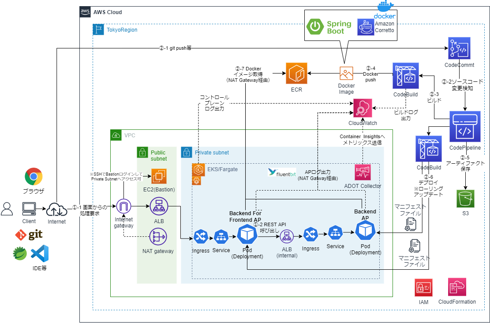

# SpringBoot APをEKS/Fargateで動作させCode系でCI/CDするCloudFormationサンプルテンプレート
## 構成
* システム構成図（最終形）
  * 最終目標の構成は、以下を想定しているが、まだできていない


* システム構成図（現時点）
  * 現時点の構成は、以下の通り


* メトリックスのモニタリング
  * 現状、未対応。今後対応予定。
  * AWS Distro for OpenTelemetry (ADOT)を使用してメトリクスをCloudWatch Containe Insightsに送信
  
* ログの転送
  * 現状、未対応。今後対応予定。
  * Fluent Bitをベースにした組み込みのログルーターを設定し、CloudWatch Logsへログを送信
  
* オートスケーリング
  * 現状、未対応。今後対応予定。
  * Horizontal Pod AutoScaler
    * https://docs.aws.amazon.com/ja_jp/eks/latest/userguide/horizontal-pod-autoscaler.html
    * メトリックスサーバのインストールが必要
      * https://docs.aws.amazon.com/ja_jp/eks/latest/userguide/metrics-server.html

* CI/CD
  * CodeBuildによる自動ビルド、ECRプッシュに対応。
  * 現状、CodePipeline、k8sのローリングアップデートによるCDは未対応。今後対応予定。
## 事前準備
* CodePipeline、CodeBuildのArtifact用のS3バケットを作成しておく
* kubectl, eksctl, helmをインストールしておく
  * 参考
    * https://docs.aws.amazon.com/ja_jp/eks/latest/userguide/install-kubectl.html
    * https://docs.aws.amazon.com/ja_jp/eks/latest/userguide/eksctl.html
    * https://docs.aws.amazon.com/ja_jp/eks/latest/userguide/helm.html
## IAM
### 1. IAMの作成
```sh
aws cloudformation validate-template --template-body file://cfn-iam.yaml
aws cloudformation create-stack --stack-name EKS-IAM-Stack --template-body file://cfn-iam.yaml --capabilities CAPABILITY_IAM
```
## CI環境
### 1. アプリケーションのCodeCommit環境
* 別途、以下の2つのSpringBootAPのプロジェクトが以下のリポジトリ名でCodeCommitにある前提
  * backend-for-frontend
    * BFFのAP
    * backend-for-frontendという別のリポジトリに資材は格納
  * backend
    * BackendのAP
    * backendという別のリポジトリに資材は格納
* TBD: CD変更検知用のk8sマニフェストファイルのリポジトリ

### 2. ECRの作成
```sh
aws cloudformation validate-template --template-body file://cfn-ecr.yaml
aws cloudformation create-stack --stack-name ECR-Stack --template-body file://cfn-ecr.yaml
```

### 3. CodeBuildのプロジェクト作成
```sh
aws cloudformation validate-template --template-body file://cfn-bff-codebuild.yaml
aws cloudformation create-stack --stack-name BFF-CodeBuild-Stack --template-body file://cfn-bff-codebuild.yaml
aws cloudformation validate-template --template-body file://cfn-backend-codebuild.yaml
aws cloudformation create-stack --stack-name Backend-CodeBuild-Stack --template-body file://cfn-backend-codebuild.yaml
```
* Artifact用のS3バケット名を変えるには、それぞれのcfnスタック作成時のコマンドでパラメータを指定する
    * 「--parameters ParameterKey=ArtifactS3BucketName,ParameterValue=(バケット名)」

* 本当は、CloudFormationテンプレートのCodeBuildのSorceTypeをCodePipelineにするが、いったんDockerイメージ作成して動作確認したいので、今はCodeCommitになっている。動いてはいるので保留。

* TODO: Mavenのカスタムローカルキャッシュによるビルド時間短縮がうまく動いていない
  * ひょっとしたら、ローカルキャッシュではなくS3でないとうまくいかない？
    * https://docs.aws.amazon.com/ja_jp/codebuild/latest/userguide/build-caching.html  
    * https://aws.amazon.com/jp/blogs/devops/how-to-enable-caching-for-aws-codebuild/

### 3. ECRへ最初のDockerイメージをプッシュ
2つのCodeBuildプロジェクトが作成されるので、それぞれビルド実行し、ECRにDockerイメージをプッシュさせる。

## ネットワーク環境
* eksctlコマンドで、EKS専用のVPCを作成しクラスタ起動することもできるが、サンプルでは既存のVPCを使ってクラスタ起動する場合を想定した手順とする。
### 1. VPCおよびサブネット、Publicサブネット向けInternetGateway等の作成
* 以下のコマンドを実行する。
```sh
aws cloudformation validate-template --template-body file://amazon-eks-vpc-private-subnets.yaml
aws cloudformation create-stack --stack-name EKS-VPC-Stack --template-body file://amazon-eks-vpc-private-subnets.yaml
```
* なお、ロードバランサーよる自動サブネット検出のため、作成されるサブネットには以下のタグを付与されるようにしている。
  * 外部ロードバランサが仕様するパブリックサブネット
    * kubernetes.io/role/elb : 1
  * 内部ロードバランサが仕様するプライベートサブネット 
    * kubernetes.io/role/internal-elb : 1
  * 参考
    * https://aws.amazon.com/jp/premiumsupport/knowledge-center/eks-vpc-subnet-discovery

* TODO: 以下のサイトにあるCfnサンプルテンプレートをベースしているので、カスタマイズ版を作成予定
  * https://docs.aws.amazon.com/ja_jp/eks/latest/userguide/creating-a-vpc.html
    * Cfnサンプルテンプレート
      * https://amazon-eks.s3.us-west-2.amazonaws.com/cloudformation/2020-10-29/amazon-eks-vpc-private-subnets.yaml
* TODO: NAT Gatewayの作成も含まれているので、いずれ別ファイルのテンプレートにする
### 2. Security Groupの作成
* TODO: Batsionの追加等で、必要なSecurity Groupの作成
### 3. VPC Endpointの作成とプライベートサブネットのルートテーブル更新
* TODO: 完全Private化のため、NATGatewayリソースの削除しVPC Endpointを作成
  * 参考
    * https://docs.aws.amazon.com/ja_jp/eks/latest/userguide/private-clusters.html   
    * なお、eksctlで完全Privateなクラスタ設定が可能だが、全てPrivate Subnetのみで構築となるので、今回のようなPublic SubnetにALBを配置し、以降はPrivate Subnet上のk8sリソース上のAPへアクセスするといったIngressの設定ができないので使わない。
       * https://eksctl.io/usage/eks-private-cluster/
## DB環境
* TBD:　今後Aurora等のRDBリソースのサンプル作成を検討

## EKS環境
* 以降、envsubstコマンドを使うので、Windowsの場合には、Git bashで実行するとよい
### 1. 環境変数設定
* envsubstコマンド等での利用のため環境変数を設定しておく
```sh
AWS_ACCOUNT_ID=(AWSアカウントID)
AWS_REGION=(リージョン) #例：AWS_REGION=ap-northeast-1
EKS_CLUSTER_NAME=demo-eks-cluster #作成するEKSのクラスタ名
K8S_VERSION=1.22 #インストールしたkubectlのバージョン
#CloudFormationの出力表示で「VpcId」の内容を確認
VPC_ID=(EKSクラスタのVPC_ID)
#CloudFormationの出力表示で「SubnetIds」の内容を確認
PUB_SUBNET1_ID=（1つ目のパブリックサブネットのID）
PUB_SUBNET2_ID=（2つ目のプライベートサブネットのID）
PRIV_SUBNET1_ID=（1つ目のパブリックサブネットのID）
PRIV_SUBNET2_ID=（2つ目のプライベートサブネットのID）
#ECRのベースアドレス
ECR_HOST=$AWS_ACCOUNT_ID.dkr.ecr.$AWS_REGION.amazonaws.com

export AWS_ACCOUNT_ID
export AWS_REGION
export EKS_CLUSTER_NAME
export K8S_VERSION
export VPC_ID
export PUB_SUBNET1_ID
export PUB_SUBNET2_ID
export PRIV_SUBNET1_ID
export PRIV_SUBNET2_ID
export ECR_HOST
```
### 2. EKSクラスタの作成
* 以下のeksctlコマンドの実行を実行しFargateでEKSクラスタを作成
```sh
#Dry Run
envsubst < ekscluster.yaml | eksctl create cluster -f - --dry-run

#実行
envsubst < ekscluster.yaml | eksctl create cluster -f -
```
* EKSクラスタの作成確認
```sh
#クラスタノードの表示
kubectl get nodes -o wide
#クラスタ上のPodの表示
kubectl get pods --all-namespaces -o wide
```
* Fargateプロファイルの作成確認
```sh
eksctl get fargateprofile --cluster $EKS_CLUSTER_NAME -o yaml
```

* 参考
  * eksctlコマンドの実行
    * https://eksctl.io/introduction/#getting-started
  * ClusterConfigファイルの仕様
    * https://eksctl.io/usage/schema/
  * クラスターがサービスアカウントにIAMを使用する
    * https://eksctl.io/usage/iamserviceaccounts/
  * 既存のVPC上での作成
    * https://eksctl.io/usage/vpc-networking/
  * コントロールプレーンのCloudWatch Logsの有効化
    * https://eksctl.io/usage/cloudwatch-cluster-logging/
  * Fargate対応
    * https://eksctl.io/usage/fargate-support/    

* TODO: ClusterConfigファイルに、addonsでaws-load-balancer-controllerの記載を追加するとどうなるのか試してみる

* TODO: クラスタの完全Privateクラスタ化(VPC endpoint化)
  * https://docs.aws.amazon.com/ja_jp/eks/latest/userguide/private-clusters.html
  * https://aws.amazon.com/jp/blogs/containers/de-mystifying-cluster-networking-for-amazon-eks-worker-nodes/
  * https://eksctl.io/usage/eks-private-cluster/


### 3. ALBの作成
* Fargateでは最も簡単なCLBのロードバランサが使えない。IngressとしてALBを作成するための設定が必要。
  * 参考
    * https://aws.amazon.com/jp/premiumsupport/knowledge-center/eks-alb-ingress-controller-fargate/
    * https://docs.aws.amazon.com/ja_jp/eks/latest/userguide/aws-load-balancer-controller.html
    * https://docs.aws.amazon.com/ja_jp/eks/latest/userguide/alb-ingress.html

* クラスタ作成時に、AWS LoadBalancer Controller用のサービスアカウントも作成されたかの確認
```sh
eksctl get iamserviceaccount --cluster $EKS_CLUSTER_NAME --name aws-load-balancer-controller --namespace kube-system
```

* helmを使用してAWS Load Balancer Controllerをインストール
```sh
#Amazon EKSチャートレポをHelmに追加
helm repo add eks https://aws.github.io/eks-charts
helm repo update

#TargetGroupBinding カスタムリソース定義 (CRD) をインストール
kubectl apply -k "github.com/aws/eks-charts/stable/aws-load-balancer-controller//crds?ref=master"

#Helm チャートをインストール
#us-west-2以外のAWSリージョンにデプロイする場合は「--set image.repository」オプションで
#以下のサイトにあるリポジトリを指定
#https://docs.aws.amazon.com/ja_jp/eks/latest/userguide/add-ons-images.html
helm install aws-load-balancer-controller eks/aws-load-balancer-controller \
    --set clusterName=$EKS_CLUSTER_NAME \
    --set serviceAccount.create=false \
    --set region=$AWS_REGION \
    --set vpcId=$VPC_ID \
    --set image.repository=602401143452.dkr.ecr.$AWS_REGION.amazonaws.com/amazon/aws-load-balancer-controller \
    --set serviceAccount.name=aws-load-balancer-controller \
    -n kube-system

#AWS Load Balancer Controllerがインストールされていることを確認
kubectl get deployment -n kube-system aws-load-balancer-controller    
#問題がある場合にログを見るとよい
kubectl logs -n kube-system deployment.apps/aws-load-balancer-controller
```

### 4. ログ、メトリックス出力の設定
* コントロールプレーンのログ
  * クラスタ作成時のClusterConfigファイルの設定により以下のロググループにログ出力
    * /aws/eks/demo-eks-cluster/cluster
* データプレーンのログ、メトリックス
  * EKS/Fargateの場合、以下の対応が必要
    * Fluent Bitをベースにした組み込みのログルーターを設定し、CloudWatch Logsへログを送信
    * AWS Distro for OpenTelemetry (ADOT)を使用してメトリクスをCloudWatch Containe Insightsに送信  
    * 参考
      * https://docs.aws.amazon.com/ja_jp/eks/latest/userguide/fargate-logging.html
      * https://blog.mmmcorp.co.jp/blog/2021/08/11/post-1704/
      * https://docs.aws.amazon.com/ja_jp/eks/latest/userguide/monitoring-fargate-usage.html
      * https://docs.aws.amazon.com/ja_jp/AmazonCloudWatch/latest/monitoring/Container-Insights-EKS-otel.html#Container-Insights-EKS-otel-Fargate
  * TBD: 手順

### 5. k8sリソースの作成、APの起動
* Namespaceの作成
```sh
cd k8s
kubectl apply -f k8s-demo-app-namespace.yaml
```

* Backend APの作成
```sh
#Deploymentの作成
envsubst < k8s-backend-deployment.yaml | kubectl apply -f -

#Serviceの作成
kubectl apply -f k8s-backend-service.yaml

#Ingressの作成
kubectl apply -f k8s-backend-ingress.yaml

#Ingressの作成確認
kubectl get ingress/backend-app-ingress -n demo-app
```

* BFF APの作成
```sh
#Deploymentの作成
#kubectl get ingress/backend-app-ingress -n demo-appでADDRESSからBackend向けのALBのDNSを取得し設定
BACKEND_LB_DNS=(Backend APのロードバランサ)
#例：BACKEND_LB_DNS=a5027f47adc0d4c10bc2da33b708b8fc-1647541580.ap-northeast-1.elb.amazonaws.com
export BACKEND_LB_DNS
envsubst < k8s-bff-deployment.yaml | kubectl apply -f -

#Serviceの作成
kubectl apply -f k8s-bff-service.yaml

#Ingressの作成
kubectl apply -f k8s-bff-ingress.yaml

#Ingressの作成確認
kubectl get ingress/bff-app-ingress -n demo-app
```

### 6. APの実行確認
* TODO: bationのEC2とSecurityGroupの作成手順の追加

* Backend AP
  * VPC内のbationを作成し、curlコマンドで動作確認
```sh
curl http://(ロードバランサのDNS名)/backend/api/v1/users
```

* Bff AP
  * ブラウザで確認
    * サンプルAPは、ECS用のCloudFormationサンプルと共用しているので、画面に「Hello! AWS ECS sample!」と表示されるが気にしなくてよい。
```sh
http://(ロードバランサのDNS名)/backend-for-frontend/index.html
```

## CD環境
### 1. CodePipelineの作成
* TBD

### 2. CodePipelineの確認
* TBD

### 3. ソースコードの変更
* TBD

## k8sリソースとEKSクラスタ等の削除
```sh
kubectl delete ingress bff-app-ingress -n demo-app
kubectl delete ingress backend-app-ingress -n demo-app
kubectl delete service bff-app-service -n demo-app
kubectl delete service backend-app-service -n demo-app
kubectl delete deployment bff-app -n demo-app
kubectl delete deployment backend-app -n demo-app

helm uninstall aws-load-balancer-controller -n kube-system

eksctl delete cluster --name $EKS_CLUSTER_NAME
```
