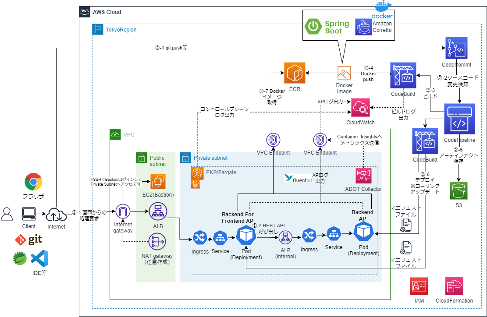

# SpringBoot APをEKS/Fargateで動作させCode系でCI/CDするCloudFormationサンプルテンプレート
## 構成
* システム構成図
  * TODO: 最終目標の構成で現状ここまでできていない

  
## 事前準備
* CodePipeline、CodeBuildのArtifact用のS3バケットを作成しておく
* kubectl, eksctl, helmをインストールしておく
## IAM
### 1. IAMの作成
```sh
aws cloudformation validate-template --template-body file://cfn-iam.yaml
aws cloudformation create-stack --stack-name EKS-IAM-Stack --template-body file://cfn-iam.yaml --capabilities CAPABILITY_IAM
```
## CI環境
* 別途、以下の2つのSpringBootAPのプロジェクトが以下のリポジトリ名でCodeCommitにある前提
  * backend-for-frontend
    * BFFのAP
  * backend
    * BackendのAP
  * TBD: CD変更検知用のマニフェストファイルのリポジトリ

### 1. ECRの作成
```sh
aws cloudformation validate-template --template-body file://cfn-ecr.yaml
aws cloudformation create-stack --stack-name ECR-Stack --template-body file://cfn-ecr.yaml
```

### 2. CodeBuildのプロジェクト作成
```sh
aws cloudformation validate-template --template-body file://cfn-bff-codebuild.yaml
aws cloudformation create-stack --stack-name BFF-CodeBuild-Stack --template-body file://cfn-bff-codebuild.yaml
aws cloudformation validate-template --template-body file://cfn-backend-codebuild.yaml
aws cloudformation create-stack --stack-name Backend-CodeBuild-Stack --template-body file://cfn-backend-codebuild.yaml
```
* Artifact用のS3バケット名を変えるには、それぞれのcfnスタック作成時のコマンドでパラメータを指定する
    * 「--parameters ParameterKey=ArtifactS3BucketName,ParameterValue=(バケット名)」

* 本当は、CloudFormationテンプレートのCodeBuildのSorceTypeをCodePipelineにするが、いったんDockerイメージ作成して動作確認したいので、今はCodeCommitになっている。動いてはいるので保留。

* TBD: Mavenのカスタムローカルキャッシュによるビルド時間短縮がうまく動いていない
  * ひょっとしたら、ローカルキャッシュではなくS3でないとうまくいかない？
    * https://docs.aws.amazon.com/ja_jp/codebuild/latest/userguide/build-caching.html  
    * https://aws.amazon.com/jp/blogs/devops/how-to-enable-caching-for-aws-codebuild/

### 3. ECRへ最初のDockerイメージをプッシュ
2つのCodeBuildプロジェクトが作成されるので、それぞれビルド実行し、ECRにDockerイメージをプッシュさせる

## ネットワーク環境
* TODO: ekctlコマンドで、事前に作成したVPC上にクラスタ作成するようにする
### 1. VPCおよびサブネット、Publicサブネット向けInternetGateway等の作成
```sh
aws cloudformation validate-template --template-body file://cfn-vpc.yaml
aws cloudformation create-stack --stack-name EKS-VPC-Stack --template-body file://cfn-vpc.yaml
```
### 2. Security Groupの作成
```sh
aws cloudformation validate-template --template-body file://cfn-sg.yaml
aws cloudformation create-stack --stack-name EKS-SG-Stack --template-body file://cfn-sg.yaml
```
* 必要に応じて、端末の接続元IPアドレス等のパラメータを指定
    * 「--parameters ParameterKey=TerminalCidrIP,ParameterValue=X.X.X.X/X」

### 3. VPC Endpointの作成とプライベートサブネットのルートテーブル更新
```sh
aws cloudformation validate-template --template-body file://cfn-vpe.yaml
aws cloudformation create-stack --stack-name EKS-VPE-Stack --template-body file://cfn-vpe.yaml
```
### 4.（作成任意）NAT Gatewayの作成とプライベートサブネットのルートテーブル更新
* 本手順では、ECRのイメージ転送量等にかかるNAT Gatewayのコスト節約から、全てVPC Endpointで作成するので、NAT Gatewayは通常不要。
  * とはいえ、全部VPC Endpointにすると、エンドポイント数分、デモ程度で何度も起動したり落としたりで1時間未満でも時間単位課金でコストがかえって結構かかる場合もある。その場合の調整として、本手順のVPC Endpoint作成対象を減らす等カスタマイズして、VPC Endpoint未作成のリソースアクセスに使用するために以下を追加実行すればよい。

```sh
aws cloudformation validate-template --template-body file://cfn-ngw.yaml
aws cloudformation create-stack --stack-name EKS-NATGW-Stack --template-body file://cfn-ngw.yaml
```


## DB環境
* TBD:　今後Aurora等のRDBリソースのサンプル作成を検討

## EKS環境
### 1. EKSクラスタの作成
* 以下のeksctlコマンドを実行
  * TODO: ClusterConfigファイルでの実行（eksctl create cluster -f ekscluster.yaml）

```sh
set AWS_ACCOUNT_ID = (AWSアカウントID)
set AWS_REGION = (リージョン)
set EKS_CLUSTER_NAME = demo-eks-cluster

eksctl create cluster ^
--name %EKS_CLUSTER_NAME% ^
--version 1.22 ^
--region %AWS_REGION% ^
--fargate
#--dry-runオプションでDry Run可能

#TODO: コマンドオプションの追加検討
#--with-oidc ^
#--vpc-cidr XXX ^
#--vpc-public-subnets XXX ^
#--vpc-private-subnets XXX ^
#--alb-ingress-access ^
#--full-ecr-access
```

* EKSの動作確認
```sh
#クラスタノードの表示
kubectl get nodes -o wide
#クラスタ上のPodの表示
kubectl get pods --all-namespaces -o wide
```

### 2. ALBの作成
* Fargateでは、CLBのロードバランサが使えないためALB作成のための設定が必要
  * 参考
    * https://aws.amazon.com/jp/premiumsupport/knowledge-center/eks-alb-ingress-controller-fargate/
* クラスターがサービスアカウントにIAMを使用することを許可する
```sh
eksctl utils associate-iam-oidc-provider --cluster %EKS_CLUSTER_NAME% --approve
```
* ALB Controller用のIAMポリシーを作成する  
```sh
curl -o iam_policy.json https://raw.githubusercontent.com/kubernetes-sigs/aws-load-balancer-controller/v2.2.0/docs/install/iam_policy.json

aws iam create-policy --policy-name AWSLoadBalancerControllerIAMPolicy ^
--policy-document file://iam_policy.json
```
*  kube-system名前空間にaws-load-balancer-controllerという名前のサービスアカウントを作成
```sh
eksctl create iamserviceaccount ^
  --cluster=%EKS_CLUSTER_NAME% ^
  --namespace=kube-system ^
  --name=aws-load-balancer-controller ^
  --attach-policy-arn=arn:aws:iam::%AWS_ACCOUNT_ID%:policy/AWSLoadBalancerControllerIAMPolicy ^
  --override-existing-serviceaccounts ^
  --approve

#作成されたサービスロールの確認
eksctl get iamserviceaccount --cluster %EKS_CLUSTER_NAME% --name aws-load-balancer-controller --namespace kube-system  
```

* helmを使用してAWS Load Balancer Controllerをインストール
```sh
helm repo add eks https://aws.github.io/eks-charts

kubectl apply -k "github.com/aws/eks-charts/stable/aws-load-balancer-controller//crds?ref=master"

set VPC_ID = (EKSクラスタのVPC_ID)

helm install aws-load-balancer-controller eks/aws-load-balancer-controller ^
    --set clusterName=%EKS_CLUSTER_NAME% ^
    --set serviceAccount.create=false ^
    --set region=%AWS_REGION% ^
    --set vpcId=%VPC_ID% ^
    --set serviceAccount.name=aws-load-balancer-controller ^
    -n kube-system
```

### 3. Fargateプロファイルの作成
```sh
eksctl create fargateprofile --cluster %EKS_CLUSTER_NAME% ^
--region %AWS_REGION% ^
--name demo-app-profile ^
--namespace demo-app
```

### 4. k8sリソースの作成
* envsubstコマンドを使うので、Windowsの場合には、Git bashで実行するとよい

* ECRのアドレスの環境変数
```sh
cd k8s
AWS_ACCOUNT_ID=(AWSアカウントID)
AWS_REGION=(リージョン)
ECR_HOST=$AWS_ACCOUNT_ID.dkr.ecr.$AWS_REGION.amazonaws.com
echo $ECR_HOST
export ECR_HOST
```
* Namespaceの作成
```sh
kubectl apply -f k8s-demo-ap-namespace.yaml
```

* Backend APの作成
  * TODO: BackendのALBを内部ロードバランサ的にできるか？
```sh
#Deploymentの作成
envsubst < k8s-backend-deployment.yaml | kubectl apply -f -

#暫定手順：CLBロードバランサの作成（on EC2のみで動作、Fagateだと動かない）
kubectl apply -f k8s-backend-clb.yaml

#Serviceの作成
kubectl apply -f k8s-backend-service.yaml

#Ingressの作成
kubectl apply -f k8s-backend-ingress.yaml
```

* BFF APの作成
```sh
#Deploymentの作成
#kubectl get svcでEXTERNAL-IPからDNSを取得し設定
BACKEND_LB_DNS=(Backend APのロードバランサ)
#例：BACKEND_LB_DNS=a5027f47adc0d4c10bc2da33b708b8fc-1647541580.ap-northeast-1.elb.amazonaws.com
export BACKEND_LB_DNS
envsubst < k8s-bff-deployment.yaml | kubectl apply -f -

#暫定手順：CLBロードバランサの作成（on EC2のみで動作、Fagateだと動かない）
kubectl apply -f k8s-bff-clb.yaml

#Serviceの作成
kubectl apply -f k8s-bff-service.yaml

#Ingressの作成
kubectl apply -f k8s-bff-ingress.yaml
```

### 4. APの実行確認
* curlコマンドかブラウザで動作確認
```sh
#Backend AP
curl http://(ロードバランサのDNS名)/backend/api/v1/users

#Bff AP
curl http://(ロードバランサのDNS名)/backend-for-frontend/index.html
```

## CD環境
### 1. CodePipelineの作成
* TBD

### 2. CodePipelineの確認
* TBD

### 3. ソースコードの変更
* TBD

## k8sリソースとEKSクラスタの削除
```sh
kubectl delete service backend-app-service
kubectl delete service bff-app-service
kubectl delete deployment backend-app
kubectl delete deployment bff-app

#TODO: Fargateプロファイル
eksctl delete fargateprofile --name my-profile --cluster %EKS_CLUSTER_NAME%

eksctl delete cluster --name %EKS_CLUSTER_NAME%
```